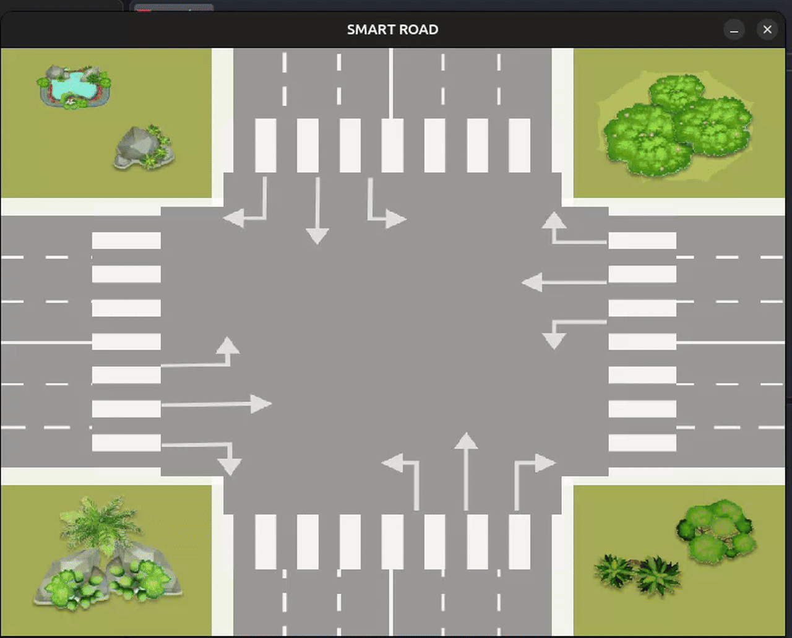

## Smart Road

### Objective
 create a new traffic strategy algorithm so that AVs can pass an intersection without any collisions and with a minimum of traffic congestion.

### Showcase



### Instructions

#### **Intersection**

- `r`, turning right
- `s`, straight ahead
- `l`, turning left

```console
               |   |   |   |   |   |   |
               |   |   |   |   |   |   |
               |   |   |   |   |   |   |
               |r  | s | l |   |   |   |
_______________| ← | ↓ | → |   |   |   |________________
                           |            ↑ r
_______________            |            ________________
                           |            ← s
_______________            |            ________________
                           |            ↓ l
___________________________|____________________________
           l ↑             |
_______________            |            ________________
           s →             |
_______________            |            ________________
           r ↓             |
_______________            |            ________________
               |   |   |   | ← | ↑ | → |
               |   |   |   | l | s | r |
               |   |   |   |   |   |   |
               |   |   |   |   |   |   |
               |   |   |   |   |   |   |
               |   |   |   |   |   |   |
```

The simplicity of this intersection is that each lane has only one outgoing direction, that is, the route of the vehicle in the
intersection area can only be represented by the corresponding lane.

---


#### **Commands**

- `Arrow Up`, generate vehicles from south to north.
- `Arrow Down`, generate vehicles from north to south.
- `Arrow Right`, generate vehicles from west to east.
- `Arrow Left`, generate vehicles from east to west.
- `R` to continually generate random vehicles (using the game loop)
- `Esc` key must finish the simulation and generate a window with all statistics

---

#### **Statistics**

- Max number of vehicles that passed the intersection
- Max velocity of all vehicles (Display the fastest speed achieved)
- Min velocity of all vehicles (Display the slowest speed reached)
- Max time that the vehicles took to pass the intersection (for all vehicles, display the one that took more time)
- Min time that the vehicles took to pass the intersection (for all vehicles, display the one that took less time)
  - The time starts to count whenever the vehicle is detected by the **smart intersection algorithm** until the end of the intersection, which is when the vehicle is removed from the canvas.
- Close calls, this is when both vehicles pass each other with a violation of the safe distance.

---

## Authors
**Galo DIOKHANE** - [*gdiokhan*](https://learn.zone01dakar.sn/git/gdiokhan) 👑

**Cheikh NDIAYE** - [*cheikhndiaye9*](https://learn.zone01dakar.sn/git/cheikhndiaye9)

**Masseck THIAW** - [*mthiaw*](https://learn.zone01dakar.sn/git/mthiaw)